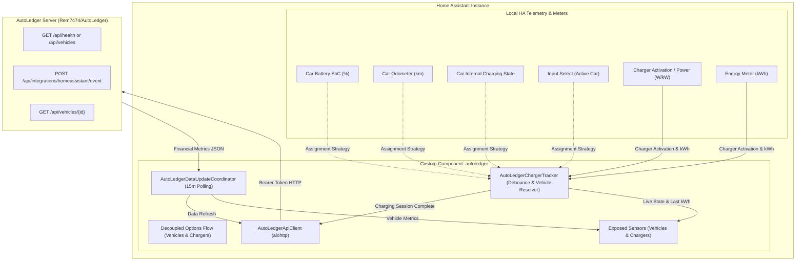

# AutoLedger - Home Assistant Integration

[](https://github.com/Rem7474/autoledger-homeassistant/actions/workflows/validate.yml)
[](https://github.com/Rem7474/autoledger-homeassistant/actions/workflows/tests.yml)
[](https://github.com/hacs/default)
[](https://opensource.org/licenses/MIT)

Official Home Assistant custom component integration for [AutoLedger](https://github.com/Rem7474/AutoLedger).

Connect your Home Assistant instance to AutoLedger to automatically detect EV charging sessions, calculate energy and financial analytics, handle dynamic solar anti-bounce interruptions, and view key vehicle metrics directly on your Lovelace dashboards.

---

## ⚡ Key Features

- **Decoupled Architecture**: Configure Vehicles and Charging Stations / Energy Meters independently. One residential charger can charge multiple cars!
- **Multi-Vehicle Support**: Associate as many vehicles from your AutoLedger instance as needed.
- **Assisted HA Device Discovery**: Select your car device (Tesla, MG iSmart, Renault, OBD-II, etc.) to pre-fill telemetry entities.
- **Dedicated Charging Stations & Sub-meters**: Link wallboxes or energy monitors (Wallbox, Easee, Shelly Pro EM, Zaptec, etc.). Supports both **Total Increasing (cumulative kWh)** and **Session Energy** counter modes.
- **4 Vehicle Assignment Strategies**:
  1. **Fixed**: Permanently associate the charging station with a specific vehicle.
  2. **Dynamic Selector (input_select)**: Pick the currently connected car dynamically using a Home Assistant `input_select` or sensor entity.
  3. **Automatic Correlation**: Auto-match the active vehicle by detecting which car is currently reporting an internal charging state.
  4. **Unassigned / Multi-vehicle**: Send charge sessions with `vehicle_id: null` so they appear under *"Charges to Qualify"* in the AutoLedger web UI.
- **Dynamic Solar Anti-Bounce Debounce Engine**: EV charging on solar power frequently pauses due to passing clouds or household load shedding. The built-in configurable debounce timer (15s - 300s, default 60s) prevents fragmented micro-sessions by consolidating them into a single cohesive charging session.
- **Dedicated Vehicle & Charger Sensors**:
  - Vehicle: `sensor.<vehicle>_last_charge_cost`, `sensor.<vehicle>_cost_per_100km`
  - Charger: `sensor.<charger>_charging_state`, `sensor.<charger>_last_energy_kwh`, `sensor.<charger>_sync_status`
- **Native HA Services**:
  - `autoledger.sync`: Force an immediate synchronization with the AutoLedger server.
  - `autoledger.submit_charge`: Manually log or automate charging session submissions from HA scripts.

---

## 🏗️ Architecture



---

## 📦 Installation

### Option 1: Via HACS (Recommended)

1. Ensure [HACS (Home Assistant Community Store)](https://hacs.xyz/) is installed.
2. In Home Assistant, open **HACS** > **Integrations**.
3. Click the three dots icon `⋮` in the top right corner and select **Custom repositories**.
4. Add the repository:
   - **Repository**: `https://github.com/Rem7474/autoledger-homeassistant`
   - **Type**: `Integration`
5. Click **Add**, locate **AutoLedger** in the integration list, and click **Download**.
6. Restart Home Assistant.

### Option 2: Manual Installation

1. Download the latest release `.zip` from GitHub.
2. Extract and copy the `custom_components/autoledger` directory into your Home Assistant `config/custom_components/` directory.
3. Restart Home Assistant.

---

## ⚙️ Configuration

### 1. Initial Connection (`ConfigEntry`)

1. In Home Assistant, navigate to **Settings** > **Devices & Services**.
2. Click **+ Add Integration** and search for **AutoLedger**.
3. Fill in your server details:
   - **Server URL**: The base URL of your AutoLedger instance (e.g., `http://192.168.1.100:8080` or `https://autoledger.yourdomain.com`).
   - **API Token**: Your AutoLedger Personal Access Token or Bearer Token.
   - **Verify SSL Certificate**: Enable or disable according to your local setup.
4. Click **Submit**. The integration validates the connection immediately.

### 2. Manage Vehicles (`OptionsFlow` > 🚗 Manage Vehicles)

1. Click **Configure** on the AutoLedger integration card, then select **Manage Vehicles**.
2. Click **Add a vehicle**.
3. Select an AutoLedger vehicle synchronized from your server and optionally an associated Home Assistant Device to pre-fill entity fields.
4. Map vehicle telemetry entities:
   - **Battery State of Charge (%)**: Vehicle battery percentage sensor (optional).
   - **Vehicle Odometer (km)**: Vehicle distance sensor (optional).
   - **Vehicle Internal Charging Status Sensor**: Internal charging sensor (optional, used for correlation mode).

### 3. Manage Charging Stations (`OptionsFlow` > 🔌 Manage Charging Stations)

1. Click **Configure** > **Manage Charging Stations** > **Add a charging station**.
2. **Step 1: Station Hardware & Settings**:
   - **Charging Station Name**: Friendly name (e.g. `Wallbox Garage`, `Smart Plug Patio`).
   - **Charging Status Sensor**: Binary sensor, switch, or power sensor (W or kW with > 500W threshold) that activates when charging begins.
   - **Charging Energy Sensor (kWh)**: Energy sensor from your wallbox or sub-meter.
   - **Energy Counter Mode**: `Total Increasing` (cumulative kWh) or `Session Energy` (resets per charge).
   - **Solar Anti-Bounce Debounce (seconds)**: Delay timer before finalizing a session (15s - 300s, default: 60s).
   - **Default Location Tag**: Default location string sent to AutoLedger (default: `home`).
3. **Step 2: Vehicle Assignment Strategy**:
   - **Fixed**: Select a linked vehicle from your configured vehicles.
   - **Dynamic Selector (input_select)**: Select an `input_select` or sensor entity indicating the vehicle currently connected.
   - **Automatic Correlation**: Automatically assigns the session to whichever vehicle is charging simultaneously.
   - **Unassigned / Multi-vehicle**: Sends `vehicle_id: null` to qualify the charge later in AutoLedger.

---

## ☀️ Solar Anti-Bounce Debounce Explained

Charging electric vehicles with solar surplus (PV diversion) often involves temporary interruptions when clouds pass over solar arrays or household appliances (ovens, heat pumps) kick in.

Standard energy loggers often register multiple tiny sessions of a few minutes, cluttering logs and distorting statistics. AutoLedger solves this:

1. **Charge Started**: The charger enters charging state. Initial odometer, initial SoC, and initial energy counter reading are recorded.
2. **Temporary Pause / Cloud**: When charging drops to `idle` / `off` (or power falls below 500W), the debounce timer arms (e.g., 60 seconds) without closing the session. The status changes to `cooling_down`.
3. **Resumption**: If charging resumes before the timer expires, the timer is aborted and the session continues seamlessly.
4. **Completion**: If the timer expires, the total energy added (`energy_final - energy_start`), final SoC, and vehicle assignment are resolved and transmitted to AutoLedger in a single event.

---

## 📊 Exposed Sensors

### Vehicle Entities
| Sensor Entity ID | Device Class | Unit | Description |
|---|---|---|---|
| `sensor.<vehicle>_last_charge_cost` | `monetary` | `€` / `$` | Total financial cost of the last charging session. |
| `sensor.<vehicle>_cost_per_100km` | - | `€/100km` | Smoothed average operating energy cost per 100 km calculated by AutoLedger. |

### Charging Station Entities
| Sensor Entity ID | Device Class | Unit | Description |
|---|---|---|---|
| `sensor.<charger>_charging_state` | - | - | Real-time state: `idle`, `charging`, or `cooling_down` (debouncing). |
| `sensor.<charger>_last_energy_kwh` | `energy` | `kWh` | Energy delivered during the last completed charging session. |
| `sensor.<charger>_sync_status` | - | - | Synchronization status: `ok`, `pending`, or `error`. |

---

## 🛠️ Home Assistant Services

### Service `autoledger.sync`
Force an immediate metrics refresh from your AutoLedger backend.

```yaml
action: autoledger.sync
data:
  entry_id: "optional_config_entry_id"
```

### Service `autoledger.submit_charge`
Manually push a charging session or trigger submissions via external automations / NFC tags.

```yaml
action: autoledger.submit_charge
data:
  vehicle_id: "c1f7a4b0-9b3e-4b2a-8921-729c4ef76a01"
  energy_kwh: 32.45
  cost: 7.50
  odometer_km: 45120
  soc_start: 20
  soc_end: 80
  location: "home"
```

---

## 🎨 Lovelace Dashboard Examples

### Example: Vehicle Summary Card (Mushroom Cards)

```yaml
type: vertical-stack
cards:
  - type: custom:mushroom-title-card
    title: Tesla Model Y
    subtitle: AutoLedger Financial & Energy Tracking

  - type: horizontal-stack
    cards:
      - type: custom:mushroom-entity-card
        entity: sensor.tesla_model_y_last_charge_cost
        name: Last Charge
        icon: mdi:ev-station
        icon_color: green

      - type: custom:mushroom-entity-card
        entity: sensor.tesla_model_y_cost_per_100km
        name: Cost / 100km
        icon: mdi:cash-multiple
        icon_color: blue

  - type: custom:mushroom-entity-card
    entity: sensor.tesla_model_y_charging_state
    name: State
    icon: mdi:lightning-bolt
```

### Example: Standard Entities Card

```yaml
type: entities
title: AutoLedger EV Status
entities:
  - entity: sensor.tesla_model_y_charging_state
    name: Charging State
  - entity: sensor.tesla_model_y_last_charge_cost
    name: Last Session Cost
  - entity: sensor.tesla_model_y_cost_per_100km
    name: Average Cost / 100km
  - entity: sensor.tesla_model_y_sync_status
    name: Sync Status
```

---

## 🧪 Testing & Validation

The codebase includes an automated unit test suite with high coverage:

```bash
# Run tests
pytest
```

---

## 📄 License

This project is licensed under the MIT License - see the [LICENSE](LICENSE) file for details.
